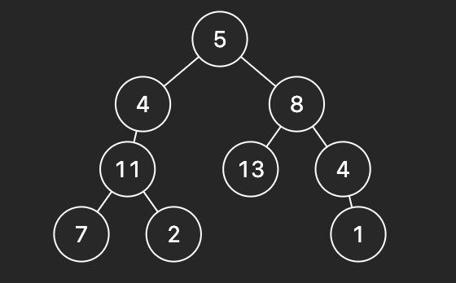
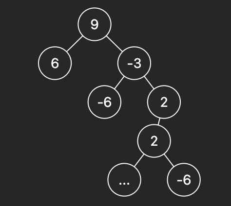

# Binary Tree Maximum Path Sum

A path in a binary tree is a sequence of nodes where each pair of adjacent nodes in the sequence has an edge connecting them. A node can only appear in the sequence at most once. Note that the path does not need to pass through the root.

The path sum of a path is the sum of the node's values in the path.

Given the root of a binary tree, return the maximum path sum of any non-empty path.

 

## Example 1:

* Input: root = [1,2,3]
* Output: 6
* Explanation: The optimal path is 2 -> 1 -> 3 with a path sum of 2 + 1 + 3 = 6.

## Example 2:

* Input: root = [-10,9,20,null,null,15,7]
* Output: 42
* Explanation: The optimal path is 15 -> 20 -> 7 with a path sum of 15 + 20 + 7 = 42.
 
## Example 3

* Input: root = [5,4,8,11,null,13,4,7,2,null,null,null,1]
* Output: 48

## Example 4

* Input: [9,6,-3,null,null,-6,2,null,null,2,null,-6,-6,-6]
* Output: 16

# Constraints:

* The number of nodes in the tree is in the range [1, 3 * 10^4].
* -1000 <= Node.val <= 1000
 